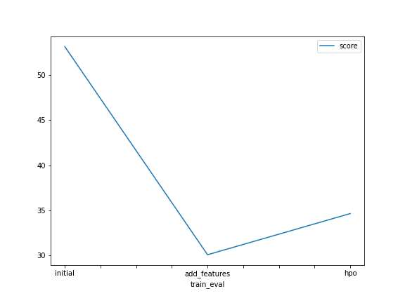
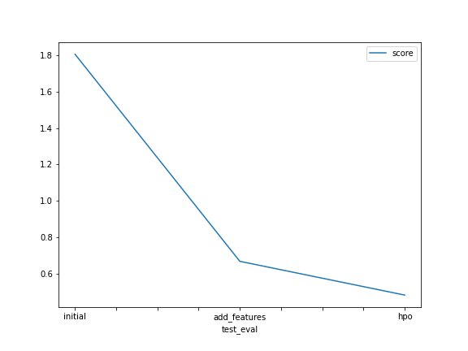

# Report: Predict Bike Sharing Demand with AutoGluon Solution
#### Ahmed Eloraby

## Initial Training
### What did you realize when you tried to submit your predictions? What changes were needed to the output of the predictor to submit your results?
Kaggle Do not accept negative answers, therefore I added a check to replace all negative predictions with zero

### What was the top ranked model that performed?
The top ranked model was WeightedEnsemble_L3 because it scored the lowest root mean square error (rmse).
## Exploratory data analysis and feature creation
### What did the exploratory analysis find and how did you add additional features?
- Holiday is a binary attribute, majority of records are not a holiday
- working is a binary attribute.
- season and weather are categorical attributes.
- temp, atemp adn humidity attributes are normaly distributed.
- windspeed, casual and registered attributes are right skewed
Hour feature was derived from datetime feature 

### How much better did your model preform after adding additional features and why do you think that is?
The best model's rmse (WeightedEnsemble_L3) decreased by around 23 and kaggle score decreased from 1.80502 to 0.66926. Therefore, adding new feature greatly influenced the model performance. it is also worth noting that some features type was changed from numerical to categorical which also might affected the performance.
Since the model became aware of a new feature (hour), it was able to better estimate the count of test cases. it might also mean that there is some sort of relation between hour and count (correlation).
## Hyper parameter tuning
### How much better did your model preform after trying different hyper parameters?
Over all, the model peroformed much better than initial and new_features models and scored the best kaggle score (0.48413). This might be possible because the hyperparameters were adjusted to our case and therefore the model had a better performance 
### If you were given more time with this dataset, where do you think you would spend more time?
Most propably most of the time will be spent in feature engineering part where I might try to remove highly correlated features and create new ones from existing data. Moreover, I would experiment with several combinations of hyperparameters and pick the best peroforming comination on test data.
### Create a table with the models you ran, the hyperparameters modified, and the kaggle score.
|model|hpo1|hpo2|hpo3|score|
|--|--|--|--|--|
|initial|default_vals|default_vals|default_vals|1.80502|
|add_features|default_vals|default_vals|default_vals|0.66926|
|hpo|GBM:num_boost_round: 100, learning_rate: 0.1, num_leaves:(10,50)|NN: num_epochs: 10, learning_rate: between 1e-4, 1e-2 (log) activation: ['relu', 'softrelu', 'tanh'], dropout_prob: (0.0, 0.5)	|RF: n_estimators: (50, 200),max_depth: (5, 20)|0.48413|

### Create a line plot showing the top model score for the three (or more) training runs during the project.

### Create a line plot showing the top kaggle score for the three (or more) prediction submissions during the project.

## Summary
TODO: Add your explanation
